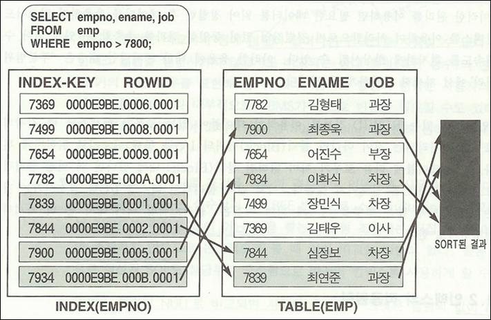

# 제 1장 액세스 효율의 향상 

`관계형 데이터베이스`는 처리하고자 하는 하는 내용에 대한 구체적인 액세스 방법을 지정하는 것이 아니라 
액세스 되어야 할 대상의 집합을 정의 하는것 

사용자는 데이터의 집합에 대한 처리를 요구할 뿐, 처리경로는 DBMS내의 옵티마이져가 담당하며 `자료사전(Data Dictionary)`을 참조하여 주어진 SQL을 해석하고 
인덱스, 클러스터 및 통계정보를 이용하여 최적의 처리가 될 수 있도록 실행계획을 수립한 후 처리한다. 

모든 데이터의 최종적으로 SQL을 통해서만 처리될 수 있다면 SQL 처리경로가 수행속도에 미치는 영향은 거의 `절대적`이라고 할 수 있다. 
먼저 옵티마이져가 처리경로를 판단하는데 있어서 가장 주용한 요소로 작용하는 `인덱스(Index)`와 `클러스터(Cluster)`의 개념과 `조인(Join)`의 효율을 향상 시킬 수 있는 방법을 알아본다. 

또한 논리적인 처리량 및 오버헤드를 획기적으로 감소시킬 수 있는 `다중처리(Array processing)`와 부분범위 `처리(Partial range scan)`에 대해서도 자세히 살펴보기로 하겠다. 
옵티마이져의 최적화 단위는 SQL이다 어떤 처리를 위해 __여러 개의 SQL을 절차형으로 나열하는 것보다 가능한 하나의 SQL에서 많은 일을 처리하도록 하여 그 처리방식이 최적화 되도록 하는것이 액세스를 효율화 하는 첩경__ 

## 1. 인덱스(Index)의 활용
인덱스는 일반적으로 생각하는 `키(Key)`라는 개념보다는 옵티마이져가 최적의 처리경로를 결정하기 위해 사용하는 `요소(Factor)`로 이해되어야 한다. 

많은 사용자들은 인덱스를 주는것이 데이터를 찾는데 도움을 줄 것이다라고 생각을 한다. 하지만 잘못된 인덱스의 적용은 되려 옵티마이져가 처리경로를 찾는데 어려움을 준다. 

그러므로 모든 테이블을 만족시킬수 있는 최소한의 인덱스를 적용을 어떻게 할 것인가는 정책적인 측면에서 고려해야하는 사항이다. 

__인덱스는 테이블의 로우(Row)와 하나씩 대응되는 별도의 객체(Object)이다.__ 인덱스는 생성시킨 컬럼(Column)들과 테이블 로우의 논리적인 주소(Rowid)로 구성되고 이들간에 서로 정렬(Sort)되어 있다. 인덱스는 하나의 테이블에 여러 개를 지정할 수 있으며 하나의 컬럼은 여러 개의 인덱스에 포함될 수도 있다. 또한 테이블과는 무관하게 생성 및 삭제를 독립적으로 실시 할 수 있다. 경우에 따라 테이블은 전혀 인덱스를 가지지 않을 수 도 있다. 인덱스의 변화에 따라 실행결과는 결코 달라지지 않으며 다만 처리경로에 영향을 미칠 따름이다. 

애플리케이션의 수정없이 인덱스의 조정만으로도 처리경로는 저절로 바뀌게 되므로 실제 실무상에서 적용해 보면 인덱스의 적절한 지정만으로도 60% 이상의 액세스 효율성을 향상시킬 수 있다. 인덱스는 결코 특정 애플리케이션을 위해 지정하는 것이 아니라 몇 개의 인덱스가 수십, 수백가지의 처리경우를 모두 만족할 수 있도록 지정해야 한다. 

가장 최적의 인덱스를 어떻게 구성할 것인가는 수 많은 애플리케이션을 작 작성하는 것보다는 훨씬 중요하다는 사실을 반드시 명심하고 프로젝트에 참여하는 단 몇명이라도 그 능력을 배양하는데 노력을 않는 것이 곧 성공의 지름길이다. 

### 1.1 인덱스의 구조

인덱스는 인덱스를 생성시킨 컬럼인 empno와 rowid로 구성되어 있으며 각각 그 값들로 정렬되어 있다. 위의 그림은 인덱스 컬럼이 `기본값(Primary key)`로 지정된 경우이며 만약 동일한 값이 여러 개 있다면 같은 값의 인덱스 로우는 다시 __rowid로 정렬되어 저장된다.__

인덱스에 있는 rowid는 테이블에 있는 로우의 `물리적인 주소(Address)`가 아니다. 즉 테이블에는 rowid가 실제로 존재하지 않으며 인덱스에 있는 rowid는 다만 테이블에 있는 해당 로우를 찾기 위해 사용되는 논리적인 정보일 뿐이다. rowid는 문자형식으로 출력할 때는 18자리로 나타나지만 실제로는 6바이트를 가진 rowid 데이터 타입으로 저장된다. 

사용자가 위의 그림에서와 같이 empno가 7800보다 큰 데이터를 찾는 sql을 실행하였고 옵티마이져가 이 수행을 위해서 인덱스를 사용하는 실행계획을 수립하였다면 먼저 `B*TREE 방식`으로 조건을 만족하는 첫번째 인덱스 로우를 찾고 처리할 범위가 끝날때까지 차례대로 로우를 `스캔(Scan)` 한다. 액세스된 인덱스 로우에 있는 `ROWID`정보를 이용하여 테이블에 있는 실제 로우를 랜덤하게 `액세스(Random Accsess)`한다. 그러므로 결국 액세스되는 테이블 로우의 순서는 인덱스 로우의 순서와 일치한다. 

이러한 원리를 이용하면 필요한 데이터를 읽어 정렬한 후 데이터를 추출하지 않고서도 인덱스를 이용하여 처리함으로써 정렬작업 없이 동일한 결과를 추출할 수 있게 되어 수행속도를 현저하게 향상 시킬 수 있다. 이러한 응용에 대한 구체적인 내용은 `부분범위 처리` 에서 자세히 설명하게 될 것이다. 

__인덱스에 있는 ROWID 정보를 이용하여 테이블에 있는 로우가 액세스될 때 각각의 로우별로 처리되는 것이 아니라 `블럭(Block) 단위`의 I/O를 통해 메모리롤 읽혀지게 된다.__  만약 테이블에 다음 로우가 이미 읽혀진 블럭내에 있다면 더 이상 물리적으로 디스크 I/O를 일으키지 않는다. 이와 같이 물리적인 디스크 I/O를 감소시키는 것은 수행속도에 많은 영향을 미치게 되며 이것은 `클러스터링 팩터`에서 좀 더 자세히 설명한다. 

### 1.2 인덱스의 적용 원칙
생성된 인덱스는 경우에 따라 하나 이상 사용되기도 하고 전혀 사용되지 않을 수도 있다. `옵티마이져(Optimizer)`에 의해 판단되는 __액세스 경로는 주어진 조건, `인덱스의 구성`, `통계정보`, `클러스터링`, `SELECT list`, `사용자의 코딩(Coding)`, `힌트(Hint)`, `옵티마이져 모드(Mode)` 등에 따라 다양하게 나타나며 이 결정된 액세스 경로에 따라 수행속도가 좌우된다.__ 

그러므로 양호한 액세스 경로를 보장받으려면 옵티마이져의 액세스 생성원리에 대한 이해를 바탕으로 좋은 액세스 경로가 생성될 수 있도록 테이블을 설계하고, 적절하게 종합적인 경우를 대비한 인덱스의 지정, 넓은 범위의 처리나 조인의 효율성을 향상하기 위한 클러스터링, 인덱스 적용원칙에 맞는 SQL의 코딩, 효율적인 SQL의 구사, 통계자료의 주기적인 재생성, 힌트나 사용제한 (Suppressing)기능을 활용하여 옵티마이져를 제어하는 드의 적절한 노력이 필요하다. 

이 절에서는 인덱스 적용원칙의 정확한 이해를 통해 잘못된 코딩으로 인하여 인덱스가 있음에도 불구하고 사용하지 못하는 경우를 방지하고, 이러한 기능을 역으로 이용하여 사용자가 원하는 액세스 경로로 유도하는 방법을 살펴 보기로 한다. 
인덱스가 사용되지 않는 경우는 다음과 같다. 
- 인덱스 컬럼은 비교되기 전에 변형이 일어나면 인덱스를 사용할 수 없다. 그러나 인덱스 컬럼을 변형시키지 않고서도 비교되는 상대 컬럼(혹은 상수)의 변형을 통해 거의 모든 경우를 표현해 낼 수 있다. 인덱스 컬럼의 변형은 사용자의 코딩에 의해서 뿐만 아니라 내부적으로 DBMS가 스스로 변형을 일으킬 수도 있다. 이러한 성질을 역이용하여 고의적인 변형(Suppressing)을 통해 원하는 액세스 경로로 유도하기로 한다. 
- 부정형(Not, <>)으로 조건을 기술한 경우에도 인덱스를 사용하지 않는다. 인덱스 컬럼은 비교되는 상수값과 B*TREE 방식으로 스트링(String)을 비교하여 찾는 것이므로 주어진 값이 아닌 값을 찾는 부정형 조건에는 직접 비교해야 할 값이 존재하지 않으므로 논리적으로 볼 대 비교할 방법이 없다. 물론 부정형으로 작성된 SQL도 상당부분 긍정형으로 바꾸어 인덱스를 사용하게 할 수 없다. 
- 인덱스 컬럼이 NULL로 비교되면 사용될 수 없다. 그섯은 컬럼의 값이 NULL인 로우는 인덱스에 저장되지 않기 때문이다. 물론 여러 컬럼으로 구성된 결합 인덱스의 첫번째 컬럼이 아닌 값을 NULL로 비교하는 경우에는 인덱스가 사용된다. 
- 옵티마이져가 필요에 따라 상기 적용원칙을 준수했음에도 불구하고 특정 인덱스의 사용을 취사 선택함으로써 사용되지 않는 인덱스가 생길 수 있다. 이는 인덱스 머지(Merge)를 피하기 위해서나 조건의 순위(Ranking)에 차이가 있을 때의 취사 선택, 사용자의 힌트, 틍계정보에 의거하여 산출된 액세스 비용(Cost)의 차이 등의 이유로 발생되며 옵티마이져 모드에 따라 서로 다를 수도 있다. 

